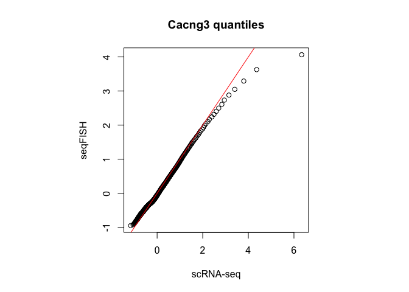
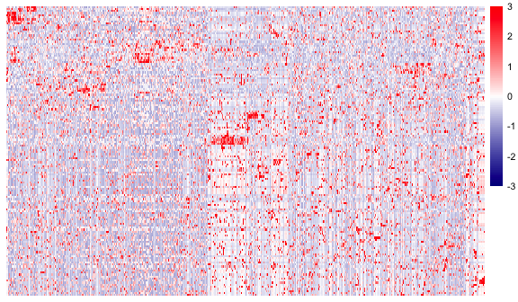
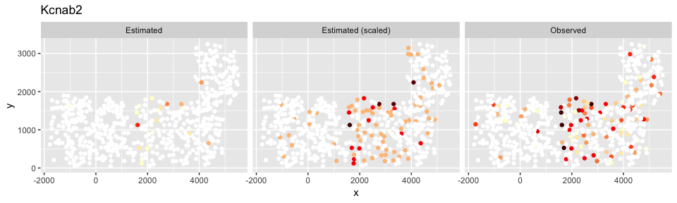

<!-- README.md is generated from README.Rmd. Please edit that file -->
README
------

This package contains wrapper functions for a Spatial Expression Regression Algorithm (SERA) to infer upon unmeasured spatial patterns of gene expression through the integration of single-cell RNA-seq (scRNA-seq) and sequential fluorescence *in situ* hybridization (seqFISH) data.

Installation
------------

``` r
install.packages("devtools", repos="http://cran.rstudio.com/")
library(devtools)
devtools::install_github("seasamgo/sera")
library(sera)
```

Methods
-------

Methods in the `sera` package expect processed cell by gene seqFISH and scRNA-seq expression matrices, having been z-score standardized by rows and columns. SERA is implemented in three steps

1.  `quantileNormalize`: ensure statistically similar distributions
2.  `predictExpression`: [multi-response elastic net](https://arxiv.org/abs/1311.6529) regression
3.  `determineEstimableGenes`: local polynomial regression of estimate variances against the *L*<sub>1</sub> norm of corresponding model coefficient estimates

``` r
quantileNormalize(
  seqFISH_expression,        # gene by cell expression matrix to be normalized
  scRNAseq_expression,       # gene by cell expression matrix for target
  normalize_scRNAseq = TRUE  # quantile-normalize scRNA-seq expression first
)

predictExpression <- function(
  training_x,                # gene by cell training predictor matrix
  training_y,                # gene by cell training outcome matrix
  prediction_x,              # gene by cell testing predictor matrix
  lambda_mse = TRUE,         # lambda minimizing the MSE of cross-validation
  family = 'mgaussian',      # multiple responses for regression
  ...                        # other arguments that may be passed to glmnet
)
  
determineEstimableGenes <- function(
  outcome,                   # prediction matrix from predictExpression result
  fit,                       # model fit from predictExpression result
  quantile_threshold = .75   # percentile to threshold estimate variances
)
```

The `predictExpression` function uses cross-validation implemented in the `glmnet` package to select lambda. Register parallel for this, e.g.

``` r
library(foreach)
library(doParallel)
registerDoParallel(10) 
```

Example
-------

To illustrate, we'll use published [seqFISH+](https://doi.org/10.1038/s41586-019-1049-y) and [scRNA-seq](https://doi.org/10.1038/nn.4216) data from mouse visual cortex (MVC).

``` r
library(Matrix)
library(methods)
data(mvc)
summary(mvc)
#>             Length Class  Mode
#> seqFISHplus 6      -none- list
#> scRNAseq    1      -none- list
```

We'll also need some additional packages to visualize what's going on along the way.

``` r
library(ggplot2)
library(pheatmap)
```

To keep this simple, subset the data to marker genes only and randomly sample some of them from each cell type for validation purposes. Then we'll add in some random genes.

``` r
set.seed(0)
markers <- as.character(mvc$seqFISHplus$markers$gene)
markers <- markers[markers%in%colnames(mvc$seqFISHplus$expression)]
cell_type <- mvc$seqFISHplus$markers$cluster
domain_genes <- as.character(mvc$seqFISHplus$domain$gene)
domain_genes <- domain_genes[domain_genes%in%colnames(mvc$seqFISHplus$expression)]
domain_type <- mvc$seqFISHplus$domain$domain
all_specific <- c(markers, domain_genes)
validation_genes <- c()
for(i in unique(cell_type)) validation_genes <- c(validation_genes, sample(markers[cell_type == i], size = 2))
for(i in unique(domain_type)) validation_genes <- c(validation_genes, sample(domain_genes[domain_type == i], size = 2))
training_genes <- all_specific[!all_specific %in% validation_genes]
validation_genes <- c(validation_genes, sample(mvc$seqFISHplus$genes[!mvc$seqFISHplus$genes%in%validation_genes], size = 100))

mvc$seqFISHplus$expression <- mvc$seqFISHplus$expression[, c(validation_genes, training_genes)]
mvc$scRNAseq$expression <- mvc$scRNAseq$expression[, c(validation_genes, training_genes)]
```

Now to apply SERA to estimate our sampled genes using the remaining genes as predictors. First, we quantile-normalize the seqFISH+ genes to the scRNA-seq genes.

``` r
qn_data <- sera::quantileNormalize(
  seqFISH_expression = methods::as(mvc$seqFISHplus$expression, 'matrix'),
  scRNAseq_expression = methods::as(mvc$scRNAseq$expression, 'matrix'),
)

par(pty = 's'); stats::qqplot(qn_data$scRNAseq_expression[,1], qn_data$seqFISH_expression[,1], xlab = 'scRNA-seq', ylab = 'seqFISH', main = paste(markers[1], 'quantiles')); abline(a = 0, b = 1, col = 2)
```



Then estimate gene expression using multi-response elastic net regression. We can select the `alpha` between 0 and 1 to favor either ridge or LASSO regression. As many cell type markers are highly correlated, use a mixture that favors LASSO.

``` r
estimates <- sera::predictExpression(
  training_x = qn_data$scRNAseq_expression[, training_genes],
  training_y = qn_data$scRNAseq_expression[, validation_genes],
  prediction_x = qn_data$seqFISH_expression[, training_genes],
  alpha = .9
)
#> computing lambda 
#> training model 
#> predicting expression
```

Let's see how these estimates compare to the observed expression values.

``` r
correlation_score <- data.frame(Correlation = round(diag(cor(estimates$outcome, qn_data$seqFISH_expression[, validation_genes])), 3))
ggplot2::ggplot(data = correlation_score, aes(x = Correlation)) + geom_histogram(binwidth = .1) + ylab('Genes')
```


``` r
correlation_score[correlation_score$Correlation > .5, , drop = FALSE]
#>          Correlation
#> Hs3st4         0.527
#> Zfp385a        0.594
#> Acsbg1         0.654
#> Gja1           0.775
#> Slc27a1        0.516
#> Gsn            0.534
#> Arhgef10       0.576
#> Kcnab2         0.554
#> Lynx1          0.708
#> Atp1a1         0.602
#> Ephb6          0.998
#> S1pr1          0.888
```

The Pearson correlation is pretty good for several of the estimated expression vectors. We'll utilize the `pheatmap` package to visualize what's going on.

``` r
fontsize = 8
paletteLength = 100
colors <- colorRampPalette(c("darkblue", 'white', "red"))(paletteLength)
breaks <- unique(c( seq(-3, 0, length.out=ceiling(paletteLength/2) + 1), seq(3/paletteLength, 3, length.out=floor(paletteLength/2))))

## Observed
ph <- pheatmap::pheatmap(t(qn_data$seqFISH_expression[, validation_genes]), show_colnames = F, show_rownames = F, cluster_rows = T, cluster_cols = T, clustering_distance_rows = 'correlation', clustering_distance_cols = 'correlation', scale = 'none', treeheight_row = 0, treeheight_col = 0, color = colors, fontsize = fontsize, breaks = breaks)
```



``` r

## Estimated
pheatmap::pheatmap(t(estimates$outcome[, validation_genes])[ph$tree_row$order, ph$tree_col$order], show_colnames = F, show_rownames = F, cluster_rows = F, cluster_cols = F, clustering_distance_rows = 'correlation', clustering_distance_cols = 'correlation', scale = 'none', treeheight_row = 0, treeheight_col = 0, color = colors, fontsize = fontsize, breaks = breaks)
```


SERA appears to have captured some of the overall expression patterns. Consider filtering the estimates using the third step of SERA.

``` r
decision_rule <- sera::determineEstimableGenes(
  outcome = estimates$outcome,
  fit = estimates$fit,
  quantile_threshold = .75
)

decision_rule$estimable_genes
#>  [1] "She"      "Cacna1e"  "Hs3st4"   "Vamp1"    "Kcnab3"   "Olfml3"  
#>  [7] "Cx3cr1"   "Acsbg1"   "Gja1"     "Slc27a1"  "Vcan"     "Matn4"   
#> [13] "Gsn"      "Arhgef10" "Kif5a"    "Lynx1"    "Boc"      "Atp1a1"  
#> [19] "Cacng3"   "Sphkap"   "Ephb6"    "Igsf11"   "Lbh"      "Lmtk2"   
#> [25] "Elovl7"   "S1pr1"    "Igfbp6"   "Limch1"   "Kirrel2"  "Ppp1r3c" 
#> [31] "Wnt7a"    "Nap1l5"
```


Nearly all of the well-performing genes were selected according to the decision rule, while still removing most of the poor estimates. Note that SERA was designed to estimate and filter hundreds of genes and this threshold may be adjusted as desired to remove only those with low variation. The filtered results capture much of the overall expression pattern.

``` r
## Observed
ph2 <- pheatmap::pheatmap(t(qn_data$seqFISH_expression[, decision_rule$estimable_genes]), show_colnames = F, show_rownames = T, cluster_rows = T, cluster_cols = T, clustering_distance_rows = 'correlation', clustering_distance_cols = 'correlation', scale = 'none', treeheight_row = 0, treeheight_col = 0, color = colors, fontsize = fontsize, breaks = breaks)
```


``` r

## Estimated
pheatmap::pheatmap(t(estimates$outcome[, decision_rule$estimable_genes])[ph2$tree_row$order, ph2$tree_col$order], show_colnames = F, show_rownames = T, cluster_rows = F, cluster_cols = F, clustering_distance_rows = 'correlation', clustering_distance_cols = 'correlation', scale = 'none', treeheight_row = 0, treeheight_col = 0, color = colors, fontsize = fontsize, breaks = breaks)
```


We also see that most of the selected genes are cell-type or domain-specific.

``` r
paste0(mean(decision_rule$estimable_genes %in% c(markers, domain_genes))*100, '%')
#> [1] "68.75%"
```

To perform your own analysis, consider predicting domain specific genes and analyze their estimated spatial pattern using the spatial coordinates.

``` r
names(mvc$seqFISHplus$spatial)
#> [1] "Field.of.View" "Cell.ID"       "X"             "Y"
```


